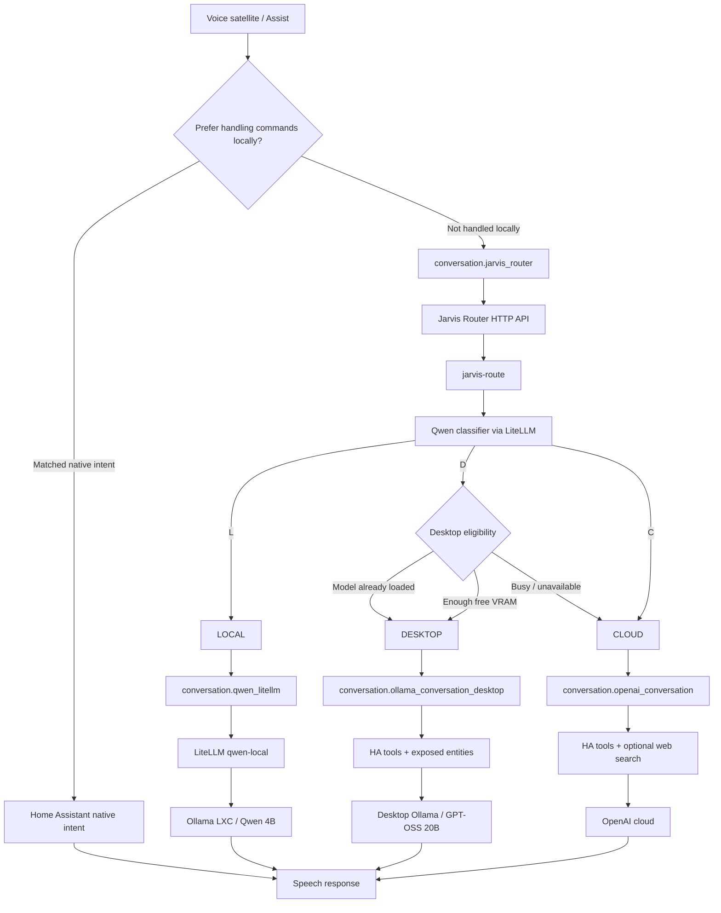

# Jarvis: Logic-Based Multi-LLM Voice Router for Home Assistant

A practical reference implementation for routing Home Assistant voice requests across:

- **Home Assistant native intents** for deterministic local commands.
- **A lightweight local LLM** for general knowledge and simple conversation.
- **A larger desktop LLM** for Home Assistant-aware questions and tool use.
- **A cloud LLM** for internet/current-information questions and as a fallback.
- **GPU/VRAM-aware routing** so the desktop LLM is only selected when the desktop can safely run it.

This repository documents a working architecture built around Home Assistant Assist, EchoMuse, LiteLLM, Ollama, OpenAI, and a small custom Python router.

> The important architectural idea is that **LiteLLM is not the semantic router**.  
> LiteLLM is an API/model gateway.  
> `jarvis-route` is the orchestration layer.  
> Home Assistant is deliberately called again after classification so that the selected Home Assistant conversation agent can provide its own tools, entity exposure, instructions, and permissions.

---

## 1. Reference deployment

The guide is written from a real deployment with the following roles:

| Role | Reference implementation |
|---|---|
| Voice satellite | EchoMuse on an Echo Dot 2 |
| Home automation | Home Assistant OS VM |
| Hypervisor | Proxmox VE 9 |
| Lightweight LLM host | Debian LXC with Ollama |
| Lightweight model | `qwen3:4b-instruct-2507-q4_K_M` |
| Model gateway | LiteLLM proxy in a Debian LXC |
| Desktop LLM host | Windows PC with RTX 5070 Ti 16 GB |
| Desktop model | `gpt-oss:20b` |
| Cloud agent | Home Assistant OpenAI conversation integration |
| Desktop GPU telemetry | Small PowerShell HTTP endpoint using `nvidia-smi` |

Reference LAN addresses used during the build:

```text
Local Ollama LXC: 192.168.0.39:11434
LiteLLM/Jarvis LXC: 192.168.0.121
Desktop Ollama:     192.168.0.50:11434
Desktop GPU API:    192.168.0.50:8098
Jarvis Router API:  192.168.0.121:8099
```

Change these values for your own environment.

---

## 2. Final architecture



### The route meanings

```text
L = no live data required
    Example: "Who wrote The Hobbit?"

D = live information from Home Assistant / the home
    Example: "How much solar am I generating now?"

C = live information from outside the home / internet
    Example: "What will the weather be like tomorrow?"
```

The classifier is intentionally small and cheap. It does **not** answer the request. It only chooses the next conversation agent.

---

## 3. Why call Home Assistant again?

This is the most important concept in the project.

A tempting design is:

```text
HA -> LiteLLM -> choose any model
```

That does not solve the Home Assistant tool/context problem.

A Home Assistant conversation agent owns things such as:

- its prompt/instructions;
- whether Home Assistant control is enabled;
- which LLM API/tools are supplied;
- which exposed entities are visible;
- web-search capability;
- integration-specific behaviour.

Therefore the router deliberately performs:

```text
Classify request
    ↓
Choose a Home Assistant conversation agent ID
    ↓
POST /api/conversation/process
    ↓
Home Assistant creates a new request using THAT agent's configuration
```

For example:

```text
D
↓
conversation.ollama_conversation_desktop
↓
Home Assistant supplies its HA tools/entities
↓
GPT-OSS answers with live household information
```

The local Qwen conversation agent has Home Assistant control disabled, so it stays fast and does not receive a large HA tool schema.

---

## 4. Repository layout

```text
.
├── README.md
├── SECURITY.md
├── config
│   ├── jarvis-router.env.example
│   └── litellm
│       └── config.yaml.example
├── docs
│   ├── architecture.md
│   ├── installation.md
│   ├── home-assistant.md
│   ├── gpu-aware-routing.md
│   ├── testing.md
│   ├── troubleshooting.md
│   ├── faq.md
│   └── lessons-learned.md
├── home-assistant
│   ├── custom_components
│   │   └── jarvis_router
│   │       ├── __init__.py
│   │       ├── config_flow.py
│   │       ├── const.py
│   │       ├── conversation.py
│   │       ├── manifest.json
│   │       └── strings.json
│   └── prompts
│       ├── local-qwen.txt
│       ├── desktop-ollama.txt
│       └── cloud-openai.txt
├── scripts
│   ├── jarvis-route
│   ├── jarvis-router-api
│   └── ollama-preload.sh
├── systemd
│   ├── jarvis-router.service
│   └── litellm.service
└── windows
    ├── gpu-status.ps1
    └── install-gpu-status-task.ps1
```

---

## 5. Suggested implementation order

Do not build every layer at once. Prove each boundary before moving on.

1. Make the lightweight Ollama model work directly.
2. Make the desktop Ollama model work directly.
3. Configure LiteLLM aliases and test them directly.
4. Configure the three Home Assistant conversation agents and test each using `conversation.process`.
5. Build `jarvis-route` as a command-line classifier.
6. Add Home Assistant handoff to `jarvis-route`.
7. Wrap it with `jarvis-router-api`.
8. Add the Home Assistant custom conversation component.
9. Put `conversation.jarvis_router` into the real voice pipeline.
10. Add GPU-aware desktop eligibility.
11. Make the Windows GPU endpoint persistent.
12. Tune prompts, thresholds, derived HA entities and scripts.

This sequence makes troubleshooting dramatically easier because every boundary has already been proven independently.

---

## 6. Fast verification

On the Jarvis/LiteLLM LXC:
Note, for my reference the solar question is unique to my set-up. You want a question that does not require live data (access to cloud) and it not also an intent question (turn something on).
```bash
/usr/local/bin/jarvis-route "Who wrote The Hobbit?"
/usr/local/bin/jarvis-route "How much solar am I generating now?"
/usr/local/bin/jarvis-route "What will the weather be like tomorrow?"
```

Watch decisions:

```bash
tail -f /var/log/jarvis-router.log
```

Expected patterns:

```text
route=LOCAL classifier=L ...
route=DESKTOP classifier=D ...
route=CLOUD classifier=C ...
```

A GPU-aware desktop route may look like:

```text
route=DESKTOP classifier=D agent=conversation.ollama_conversation_desktop reason=sufficient_free_vram model_loaded=no free_vram=12691MB question="How much solar am I generating now?"
```

If GPT-OSS is already resident:

```text
route=DESKTOP classifier=D agent=conversation.ollama_conversation_desktop reason=model_already_loaded model_loaded=yes free_vram=471MB ...
```

If the desktop cannot safely load the model:

```text
route=CLOUD classifier=D agent=conversation.openai_conversation reason=insufficient_vram model_loaded=no free_vram=8000MB ...
```

---

## 7. Home Assistant voice-pipeline setting

Keep:

```text
Prefer handling commands locally = ON
```

Then set the pipeline's conversation agent to:

```text
Jarvis Router
```

This gives native Home Assistant intents the first opportunity to handle deterministic commands such as:

```text
Turn on the kitchen light
Turn off Amelia's light
Set the bedroom light to 50 percent
```

Only requests that are not handled locally reach the multi-LLM router.

---

## 8. Security rules

Never commit:

- LiteLLM master keys;
- Home Assistant long-lived access tokens;
- OpenAI API keys;
- `ROUTER_API_KEY`;
- real `.env` files containing credentials.

Use the supplied `.example` file and keep the real `/etc/jarvis-router.env` outside Git.

If a key is pasted into chat, a terminal recording, an issue, or Git history, rotate it.

See [SECURITY.md](SECURITY.md).

---

## 9. Where to customise

The common tuning points are deliberately obvious:

### Routing classes

Edit the classifier prompt in:

```text
scripts/jarvis-route
```

### VRAM threshold

Edit:

```python
MIN_FREE_VRAM_MB = 12000
```

### Desktop model

Edit:

```python
DESKTOP_MODEL = "gpt-oss:20b"
```

and the Home Assistant Ollama agent.

### Home Assistant agent IDs

Edit:

```python
AGENTS = {
    "L": "conversation.qwen_litellm",
    "D": "conversation.ollama_conversation_desktop",
    "C": "conversation.openai_conversation",
}
```

### Spoken-answer style

Change the **instructions on the downstream HA conversation agents**, not the Jarvis front-end agent.

Examples are in:

```text
home-assistant/prompts/
```

---

## 10. Current official references

This implementation was documented against Home Assistant's 2026 conversation architecture.

Useful official references:

- Home Assistant Conversation Entity:
  https://developers.home-assistant.io/docs/core/entity/conversation/
- Home Assistant Conversation API:
  https://developers.home-assistant.io/docs/intent_conversation_api/
- Home Assistant LiteLLM integration:
  https://www.home-assistant.io/integrations/litellm/
- Home Assistant Ollama integration:
  https://www.home-assistant.io/integrations/ollama/
- Home Assistant OpenAI integration:
  https://www.home-assistant.io/integrations/openai_conversation/
- LiteLLM:
  https://docs.litellm.ai/
- Ollama:
  https://docs.ollama.com/

---

## 11. What is complete versus optional?

The core multi-LLM goal is complete when:

- native HA intents are first;
- L/D/C classification works;
- LOCAL reaches a small local LLM;
- DESKTOP reaches a tool-enabled desktop LLM;
- CLOUD reaches a cloud agent;
- a busy/unavailable desktop causes D requests to fall back to cloud.

Everything after that is optimisation:

- richer HA scripts;
- derived daily energy sensors;
- better TTS phrasing;
- more routing classes;
- richer observability;
- game-aware thresholds;
- automatic model preload/unload;
- route dashboards;
- retries and circuit breakers.
