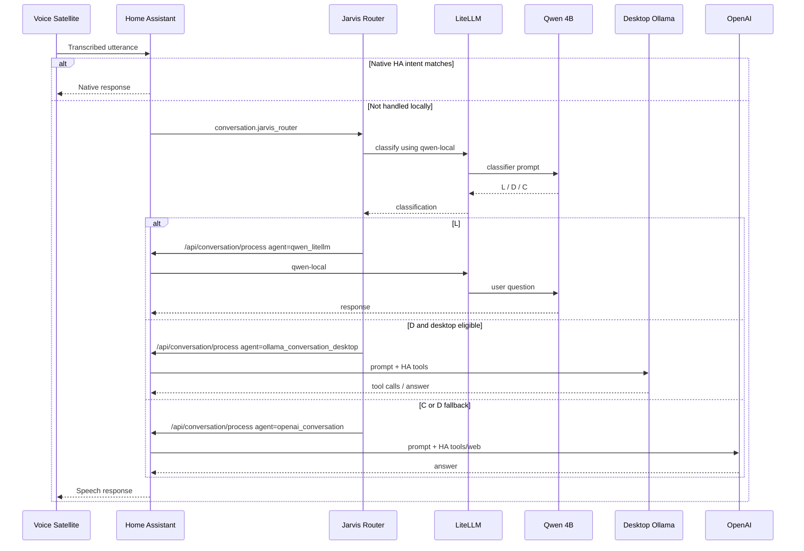

# Architecture

## 1. Design goals

The project started with several practical constraints:

1. Home Assistant's native intent engine is excellent for deterministic commands and should remain first.
2. A small local model is fast enough for simple general-knowledge questions.
3. A larger desktop model is significantly more capable but competes with games for GPU memory.
4. A cloud model is useful for current information and as a fallback.
5. Small local models become slow when Home Assistant supplies a large tool/entity schema.
6. The user should be able to understand why a particular model was selected.

The solution therefore separates:

- **intent handling**;
- **classification**;
- **resource eligibility**;
- **model execution**;
- **Home Assistant tool ownership**.

---

## 2. Logical data flow



---

## 3. Component responsibilities

### Home Assistant

Home Assistant remains the authority for:

- native intents;
- the Assist pipeline;
- exposed entities;
- LLM tool schemas;
- conversation-agent instructions;
- actual device/tool execution.

### LiteLLM

LiteLLM provides stable model aliases and one OpenAI-compatible gateway.

Example aliases:

```text
qwen-local
llm-desktop
llm-cloud
```

In this design, LiteLLM is **not** the top-level semantic router.

### `jarvis-route`

`jarvis-route` is the orchestration brain/plumbing.

It:

1. asks the small Qwen model for `L`, `D`, or `C`;
2. applies resource policy to `D`;
3. selects a Home Assistant conversation agent;
4. calls the Home Assistant Conversation REST API;
5. extracts spoken text;
6. logs the decision.

### `jarvis-router-api`

This is only an HTTP wrapper around `jarvis-route`.

Home Assistant cannot call a local shell script directly as a normal conversation agent, so the custom component POSTs to this small HTTP service.

### Home Assistant custom component

`conversation.jarvis_router`:

- receives the user's text from Assist;
- sends it to `http://<router>:8099/route`;
- receives `{"speech":"..."}`;
- returns that speech to Assist.

It is deliberately thin. It does not own Home Assistant tools.

### Windows GPU status endpoint

A tiny PowerShell service exposes:

```json
{
  "gpu_name": "NVIDIA GeForce RTX 5070 Ti",
  "total_mb": 16303,
  "used_mb": 3286,
  "free_mb": 12710,
  "utilisation": 5
}
```

`jarvis-route` uses this only when it is considering a desktop route.

---

## 4. Why not pass HA tools through LiteLLM?

Because tool context belongs to the Home Assistant conversation agent.

A lightweight HA LiteLLM agent with HA control disabled is intentionally cheap:

```text
conversation.qwen_litellm
    ↓
small prompt
    ↓
Qwen
```

A tool-enabled desktop agent is different:

```text
conversation.ollama_conversation_desktop
    ↓
HA instructions + exposed entities + tool definitions
    ↓
GPT-OSS
```

Changing the LiteLLM model alias alone does not magically attach the second agent's Home Assistant context.

The router therefore "bounces back" into Home Assistant using:

```http
POST /api/conversation/process
```

with a specific:

```json
{
  "agent_id": "conversation.ollama_conversation_desktop"
}
```

This lets Home Assistant construct the correct request.

---

## 5. GPU-aware D routing

A subtle but important detail:

### Incorrect logic

```text
if free VRAM < 12 GB:
    use cloud
```

This fails after GPT-OSS is loaded.

In the reference system:

```text
Before GPT-OSS:
free VRAM ≈ 12.7 GB

After GPT-OSS:
free VRAM ≈ 0.3–0.5 GB
```

If the model is already resident, low free VRAM is expected and the next desktop request should still use it.

### Correct logic

```text
if GPT-OSS already loaded:
    DESKTOP
else:
    if GPU endpoint unavailable:
        CLOUD
    elif free VRAM >= threshold:
        DESKTOP
    else:
        CLOUD
```

This distinction is implemented in `scripts/jarvis-route`.

---

## 6. Why `Prefer handling commands locally` stays enabled

This prevents LLMs from being used unnecessarily for deterministic Home Assistant commands.

For example:

```text
"Turn on the kitchen light."
```

should not require:

- an LLM classifier;
- a model;
- tool selection;
- cloud access.

Native HA intent handling is faster and more deterministic.

Only unmatched requests proceed to Jarvis.

---

## 7. Future extension points

The architecture can be extended without replacing its foundations.

Examples:

```text
L = local general knowledge
D = home data/action
C = internet/current information
X = specialist coding model
M = memory/RAG model
V = vision model
```

Or D could have additional policy:

```text
D
├─ desktop loaded -> desktop
├─ desktop free -> desktop
├─ desktop busy -> cloud
└─ cloud unavailable -> smaller local tool model
```

The important design principle is to keep **classification** separate from **execution capability**.
